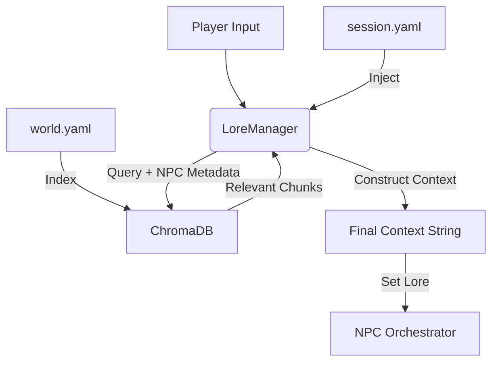

# RAG & Lore Management Module

## Philosophy & Goals
The **RAG (Retrieval-Augmented Generation) Module** serves as the "Dungeon Master's Notebook" for the system. In a traditional tabletop RPG, the Game Master (GM) doesn't memorize every detail of the world; they reference notes, maps, and rulebooks as needed. This module provides that same capability to our AI-powered NPCs.

### The Problem
Large Language Models (LLMs) are excellent at improvisation but terrible at consistency.
*   **Hallucination**: Without grounding, an NPC might invent facts that contradict the campaign setting (e.g., describing a sunny beach in a frozen wasteland).
*   **Amnesia**: NPCs forget world events or important plot points that happened outside their immediate context context window.
*   **Homogeneity**: Without specific knowledge constraints, every NPC sounds like an omniscient encyclopedia. A peasant shouldn't know the secrets of the high wizards.

### The Solution
We treat world lore not as a single text block, but as a queryable database of knowledge. We index the campaign setting into semantic "chunks" and retrieve only what is relevant to the current conversation **and** appropriate for the specific NPC speaking.

---

## Architecture

### Data Sources
The module splits data into two distinct categories:

1.  **`world.yaml` (Static Lore)**
    *   **Embedded into Vector Store**: Yes
    *   **Content**: Archetypes, NPC definitions, Locations, History, Factions, Items.
    *   **Design Principle**: "DM Notes" style. We use prose descriptions rather than complex structured data, allowing the LLM to improvise flavor while staying grounded in facts.
    *   **Simplified Structure**:
        *   *Archetypes*: "Tavern Keeper", "Guard", "Scholar" (defines typical knowledge/traits).
        *   *NPCs*: Specific characters like "Joe" (overrides archetype).
        *   *Lore*: Descriptions of places, events, and items.

2.  **`session.yaml` (Dynamic State)**
    *   **Embedded into Vector Store**: No (Injected directly)
    *   **Content**: Current time, current location, scene mood, active quests, recent world events.
    *   **Evolution**: Updated by the Context/Overhearing modules as the game progresses (e.g., changing time from "Day" to "Night", moving from "Tavern" to "Harbor").

### The Pipeline

---

## Design Decisions

### 1. "DM Notes" vs. Structured Data
**Choice**: We opted for a **prose-heavy "DM Notes" format** over rigid database schemas for world content.
*   **Why**: LLMs thrive on natural language. Instead of defining a location with strict fields like `{"lighting": "dim", "smell": "ale"}`, we write: *"A dimly lit tavern that smells of stale ale and secrets."*
*   **Benefit**: This allows the LLM to capture the *vibe* and flavor of the setting, not just the raw data. It also makes the `world.yaml` file much easier for a human GM to write and edit—it feels like writing campaign prep, not code.

### 2. Static World vs. Dynamic Session
**Choice**: We separated data into two distinct streams:
*   **Static World (`world.yaml`)**: Immutable facts about history, geography, and items. These are embedded into a vector database for semantic search.
*   **Dynamic Session (`session.yaml`)**: Mutable state like current time, location, mood, and active quests. These are injected directly into the context without retrieval.
*   **Why**: Vector databases are great for finding "that one book about dragons from 500 years ago," but terrible for tracking "is it currently night time?". Semantic search is probabilistic; game state must be deterministic. By separating them, we ensure NPCs always know *where* and *when* they are (100% accuracy) while retrieving lore flexibly.

### 3. Knowledge Filtering
**Choice**: We implemented strict **metadata filtering based on NPC archetypes**.
*   **Why**: In many RAG systems, if you ask "Where is the secret base?", the system retrieves the document describing the secret base. This breaks immersion—random NPCs shouldn't know secrets.
*   **How**:
    *   Every lore chunk is tagged with a category (e.g., `ancient_history`, `local_rumors`, `military_secrets`).
    *   Every NPC has "knowledge permissions" based on their archetype (e.g., a **Guard** knows `local_laws` and `military_tactics`; a **Scholar** knows `ancient_history` and `magic`).
    *   When an NPC searches memory, they *only* see documents their archetype is allowed to see.
*   **Benefit**: Distinct personalities emerge naturally. A tavern keeper answers a question about the ruins with superstition and rumor; a wizard answers the same question with historical fact.

### 4. Local-First Architecture
**Choice**: We use **ChromaDB** (local vector store) and **Ollama** embeddings.
*   **Why**: The project emphasizes privacy and offline capability. Running the entire stack locally ensures no campaign data leaks to external APIs and allows the system to function without an internet connection, typical for tabletop sessions.
