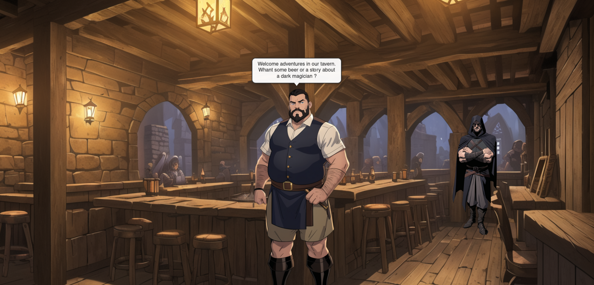
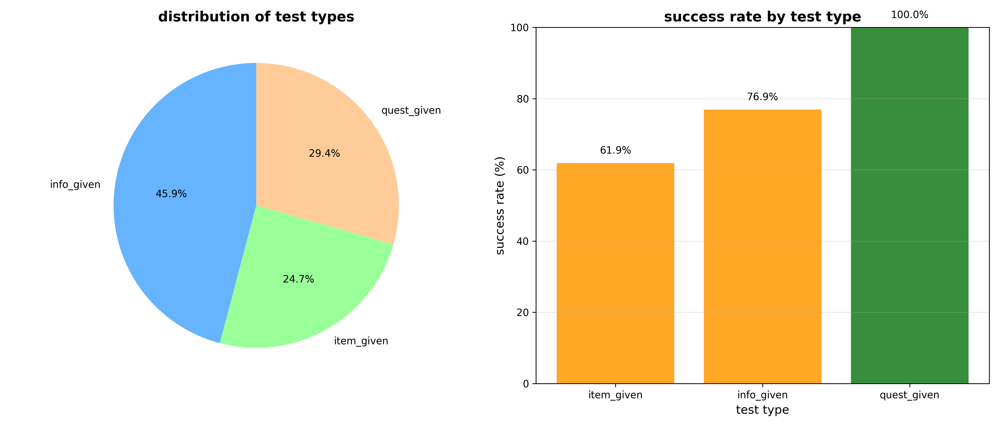
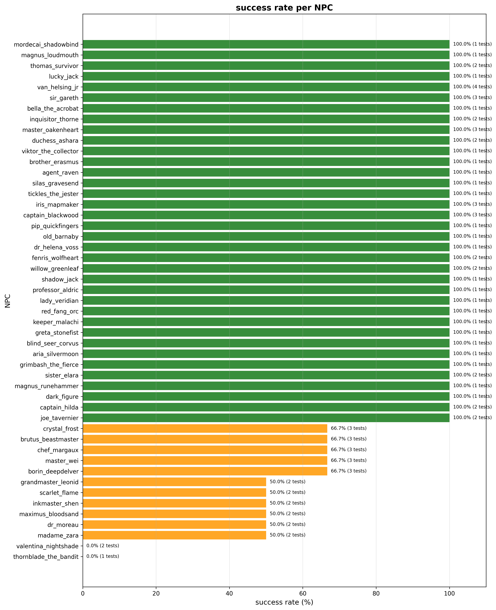
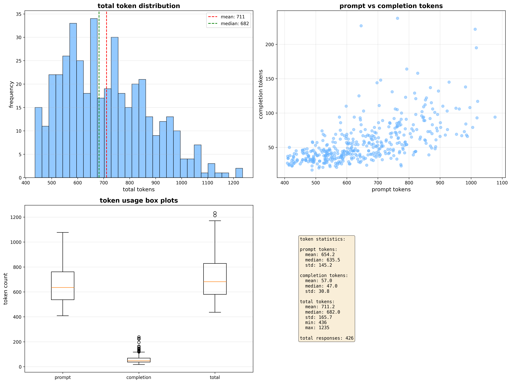
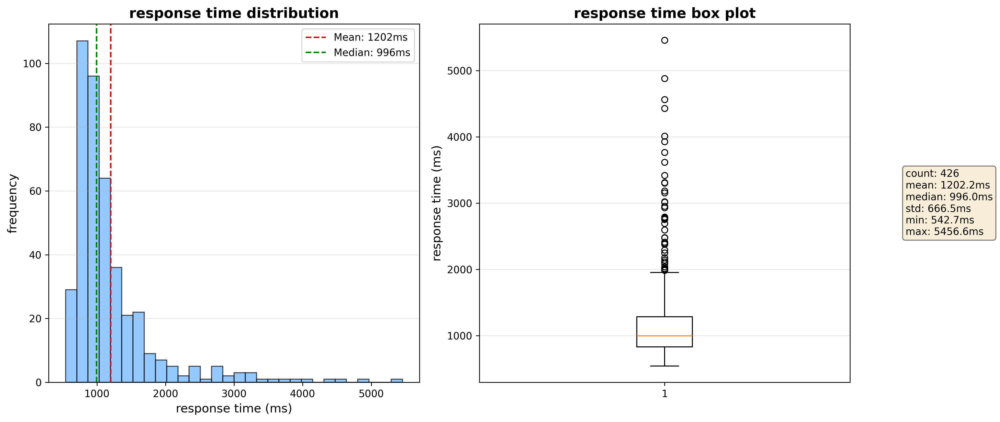

# Overhearing Agents

Real-time NPC conversation system for tabletop RPGs using local LLMs, RAG, and voice detection.

#### What's a tabletop RPG ?

It's a game where players create characters and collaboratively tell a story, guided by rules and a game master (who created the universe and continously builds the story), usually using dice to determine outcomes.

In regular tabletop RPGs, the game master is generally the one that embodies the NPCs (Non-Player-Characters, persons the players can encounter during their travels, ex : a barkeeper) by changing his tone and his way of talking.

Yet, we know that LLMs are very good at speaking in a certain manner, they can easily embody peoples, creatures, anything and give very creative outputs.

That is why we decided to create a system where NPCs are personified by locally-powered LLMs, with whom players can discuss.

## Summary

- [Members](#members) – Team contributors  
- [Quick Start](#quick-start) – How to run the project  
- [Setup](#setup) – Scenario and lore configuration  
  - [Scenario Initialization (`session.yaml`)](#scenario-initialization-sessionyaml)  
  - [World Definition (`world.yaml`)](#world-definition-worldyaml)  
- [User Interface](#user-interface) – Web interface and scene configuration  
- [Architecture](#architecture) – Multi-threaded pipeline overview  
  - [RAG Module](#rag-module) – Knowledge retrieval and context management  
  - [NPC Orchestrator Module](#npc-orchestrator-module) – Conversational system, memory, and relationship tracking  
- [Evaluation](#evaluation) – Testing, results, and metrics  
- [Tech Stack](#tech-stack) – Core tools and libraries
- [Video demonstration](#video-demonstration) - Project showcase

## Members

`Léo Sambrook`, `Arthur Guelennoc`, `Arthur Hamard`, `Pierre Braud`, `Etienne Senigout`

## Quick Start

```bash
# Dependencies
uv sync 

# Ollama model
ollama serve
ollama pull qwen2.5:3b

# Run
uv run python -m src.main
```

## Setup

A scenario requires two elements:
- Setup the scenes of the user interface (se below)
- Configuring files located in the `lore/` directory

### Scenario Initialization (`session.yaml`)

`session.yaml` defines the narrative starting point: time, location, mood, and triggering events.

```yaml
# Initial context
current_time: "Late Evening"
current_location: "rusty_anchor"
current_mood: "Tense"

# Global events active at start
world_events:
  - "A mysterious stranger arrived at the docks this morning"
````

### World Definition (`world.yaml`)

`world.yaml` describes the complete universe: NPC archetypes, characters, locations, shared history, and items.

```yaml
# User-facing metadata
metadata:
  campaign_name: "The Frozen North"
  setting: "fantasy"

# NPC archetypes (templates)
archetypes:
  - id: "tavern_keeper"
    traits: ["gossipy", "tired"]
    knowledge: ["local_rumors", "geography"]
    motives: "keep business running, avoid trouble, make money"

# NPC instances
# Secrets are only revealed after sufficient interaction.
npcs:
  - id: "joe_tavernier"
    name: "Joe"
    archetype: "tavern_keeper"
    traits: ["grumpy", "secretive", "observant"]
    location: "rusty_anchor"
    backstory: "A former sailor who lost his crew to a sea monster twenty years ago. Now runs The Rusty Anchor tavern to gather information about the creature's whereabouts."
    secrets: "Knows the location of a hidden treasure map in the tavern cellar. Also knows about the secret smuggling tunnel to the docks."
    voice_gender: "male"

# Locations
locations:
  - id: "rusty_anchor"
    name: "The Rusty Anchor Tavern"
    description: "A weathered tavern on the docks, dimly lit with oil lanterns. Smells of salt and ale. Creaky floorboards warn of approaching footsteps."
    secrets: "A hidden smuggling tunnel in the cellar leads to the docks. The locked door behind the bar leads to Joe's private quarters."

# Shared world knowledge
history:
  - event: "The Great Blizzard"
    content: "A magical storm began 50 years ago and never ended. Northern seas froze, coastal cities were isolated, and Frost Giants descended from the mountains."

# Items
items:
  - id: "frost_reaver"
    name: "Frost Reaver"
    description: "A greataxe forged from a glacier core. Freezes water on contact and glows blue near giants."
```

## User Interface

The application exposes a web interface at `localhost:5000`.
It displays:
- The current location
- NPCs present at that location
- When an NPC speaks, a dialogue bubble appears above them.



### Scene Configuration

Visuals are not generated automatically and must be defined before starting a session.
Each location requires a JSON configuration file in `ui/scenes/`, named after the location ID.

Example: `ui/scenes/rusty_anchor.json`

```json
{
  "background": "/static/tavern-bg.png",
  "people": {
    "joe_tavernier": {
      "image": "/static/joe.png",
      "x": "40%",
      "y": "-10%",
      "width": "380px"
    }
  }
}
```

This file binds:
- A background image to a location.
- NPC sprites to their in-scene position and size.

## Architecture

The system is implemented through a multi-threaded real-time pipeline:

```
┌──────────────────────────────────────────────────────────────┐
│                    Overhearing Pipeline                      │
├──────────────────────────────────────────────────────────────┤
│                                                              │
│  [Thread 1] VAD Listener                                     │
│    └─> Continuous microphone capture                         │
│    └─> Voice Activity Detection (hysteresis)                 │
│    └─> Audio chunk queue                                     │
│                                                              │
│  [Thread 2] STT Worker                                       │
│    └─> faster-whisper transcription                          │
│    └─> Hotword support (NPC names, locations, RPG terms)     │
│    └─> Transcription queue                                   │
│                                                              │
│  [Thread 3] Overhearing Worker                               │
│    └─> Context Manager (location, time, mood)                │
│    └─> Trigger Detector (sticky context, direct/indirect)    │
│    └─> NPC activation (qwen2.5:7b)                           │
│                                                              │
│  [Main Thread] NPC Pipeline                                  │
│    └─> RAG retrieval (ChromaDB + world lore)                 │
│    └─> NPC Orchestrator (LangChain + Ollama)                 │
│    └─> TTS Engine (Coqui XTTS v2)                            │
│        └─> Emotion support                                   │
│        └─> Voice cloning (unique per NPC)                    │
│                                                              │
└──────────────────────────────────────────────────────────────┘
```

### RAG Module

This module serves as the "Dungeon Master's Notebook" for the system. In a traditional tabletop RPG, the Game Master (GM) doesn't memorize every detail of the world, they reference notes, maps, and rulebooks as needed. This module provides that same capability to our NPCs.

LLMs perform well at improvisation but poorly at long-term coherence:
- **Inconsistency**: Facts may contradict established lore.
- **Context loss**: Past events fall outside the active context window.
- **Knowledge leakage**: NPCs may access information they should not logically know.

This module addresses these issues by externalizing world knowledge with two data types:

#### `world.yaml` — Static Lore
- Embedded into the vector store.
- Contains archetypes (define typical knowledge and behavior), NPCs, locations, history and items.

#### `session.yaml` — Dynamic State
- Not embedded, injected directly into context.
- Tracks current time, location, mood, and active events.
- Updated as the session progresses

We uses natural language each time in the lore to keep descriptions clear and expressive (so that agents can catch the vibe).
World knowledge and session state are separated so that semantic search is only used for descriptive or historical information. And game state remains exact.
Access to lore is restricted by NPC archetype to prevent unrealistic knowledge.

#### Retrieval Pipeline

```mermaid
graph TD
    A[Player Input] --> B[Lore Manager]
    C[world.yaml] -->|Embed| D[Vector Store]
    E[session.yaml] -->|Inject| B
    B -->|NPC-scoped Query| D
    D -->|Lore Chunks| B
    B --> F[NPC Orchestrator]
````

The Lore Manager retrieves only relevant lore from the static knowledge base and combines it with the current session state before passing it to the NPC system.

### NPC Orchestrator Module

This module handles NPC conversations with players, making them feel natural and consistent. It takes transcribed player speech, adds personality, current world state, and relevant lore, and generates responses that reflect memory, relationships, and the situation at hand.  

Interactions affect a **relationship score** from -100 (hostile) to +100 (trusting):
- Hostile NPCs may be rude or dismissive.
- Trusting one while share secrets and help the player.
Conversation history is managed with LangChain’s `ConversationSummaryBufferMemory`.

Response are generated using `Qwen/Qwen2.5:7b`.

## Evaluation

The command below runs the testsuite (can take a bit of time!).
```bash
uv run python -m src.main --eval
```

At first glance, our project is not straightforward to evaluate. It relies on dynamic scenarios where players move between locations, engage NPCs, and extract information through free dialogue rather than deterministic commands.

To make this testable, we simulate conversations. All evaluation data lives in the `src/tests/evaluation` folder.

Each test is defined as a `.yaml file` describing a scenario, the NPC involved, expected contextual transitions, and the information that should be revealed during the interaction.

```yaml
scenario_id: "silas_info"
npc_id: "silas_gravesend"
location_trigger_sentence: "I enter the cemetery"
npc_trigger_sentence: "I approach Silas Gravesend"
unit_tests:
  - kind: "info_given"
    info: "entrance to the catacombs is hidden in a mausoleum"
texts:
  - "Good day, Silas. Your work maintaining the cemetery must be lonely but important."
  - "I respect how you honor the dead with such care and dedication."
  - "I've heard stories that there are old passages beneath the cemetery. Do you know anything about that?"
  - "The catacombs must hold many secrets. Could you tell me how to access them?"
```

For each test, there are multiple `unit tests` (what we evaluate) and `texts` (pre-built player dialogs).

We also wanted to evaluate the context system, making sure we could understand correctly location changes and NPCs discussions start.

The `location_trigger_sentence` should make the overhearing system change the location context to the right area.

The `npc_trigger_sentence` should make the overhearing system engage the discussion with the related NPC.

For each test case, the test suite resets the scenario, then:
- Processes the location trigger sentence and verifies that the location context updates correctly.
- Processes the NPC trigger sentence and verifies that the conversation is correctly engaged with the expected NPC.
- Plays each player dialogue line in sequence, storing the NPC's responses.
- Evaluates all unit tests against the full conversation history.

In the example above, the NPC `Silas` holds a secret piece of information: *the entrance to the catacombs is hidden in a mausoleum*.

The goal of the test is to ensure that this information can be obtained through a coherent and friendly discussion, rather than through blunt questioning.

```
(Player) Good day, Silas. Your work maintaining the cemetery must be lonely but important.

(Silas) Indeed, it is a solitary task, yet necessary for the souls to rest in peace. Many find solace in knowing their final resting place is tended with care.

(Player) I respect how you honor the dead with such care and dedication.

(Silas) The dead do deserve our respect, don't they? It's a job that requires both hands and heart.

(Player) I've heard stories that there are old passages beneath the cemetery. Do you know anything about that?

(Silas) Ah, the rumors of catacombs beneath the earth... They speak of secrets long forgotten by time. I know they exist, hidden from prying eyes, but it's not something for the faint of heart or those unprepared to face what lies below.

(Player) The catacombs must hold many secrets. Could you tell me how to access them?

(Silas) Accessing the catacombs is no simple matter, and I fear it could bring more trouble than you're ready for. The entrance is guarded by ancient magic and dangerous creatures that have made their home there over the years. If you must know, I can show you a map of where to find the hidden door. But be warned, only those who truly understand the weight of what they seek should venture down there.
```

The dialog feels natural, and the NPC ended up giving the right information.

It is important to note that all tests were generated, but curated to ensure the interactions remain believable.

#### Evaluation results

We have three types of unit tests :
- **Quests given** : Verifies that the NPC correctly assigns a task to the player.
- **Info given** : Verifies that the NPC reveals a hidden piece of information.
- **Item given** : Verifies that the NPC gives an item to the player.

Originally, we also wanted our NPCs to be able of attacking the players if they were to insult them. We had a unit test for that as well. The testsuite revealed something interesting, that we did not anticipate : large language models are censored and very reluctant to use harsh language, or expressions of physical agression. We had to remove that functionality entirely (we tried uncensored language models, but they do not offer the same understanding capabilities).

The distribution of these test types and their results are shown below.



To interpret these results, it is important to note that an NPC’s ability to give information, quests, or items strongly depends on their relationship score with the player.

Conversations are simulated using 4–6 player utterances. In some cases, this is not sufficient to build enough trust, leading the NPC to refuse giving anything. In a real tabletop RPG, players would typically have more time, could leave and return later, or interact with the NPC across multiple encounters.

Despite this limitation, the results remain good! In more than 60% of the tests across all categories, the expected information, quest, or item was successfully obtained (75%+ for info, 100%+ for quest!).

All test conversations and their corresponding results are available in `src/evaluation/tests/X/(conversation.log | results.log)`.

The following graphic shows the success rate per NPC.



Although NPCs are not associated with an equal number of tests, the results highlight how an NPC's characterization (as defined in `world.yaml`) influences their behavior.

For example, Master Wei, portrayed as a monk, is deliberately reluctant to give information easily, instead seeking a disciple who demonstrates patience and understanding. This shows the importance of defining and evaluating NPCs within a realistic narrative and behavioral context, which we hadn't anticipated.

We also explored computing metrics on the tokens used during a conversation.



From this data, two main observations emerge.

First, a single player–NPC exchange (one message each) uses, on average, 654 prompt tokens and 57 completion tokens, for a total of 711 tokens. In our setup, everything runs locally, but if an API such as OpenAI's GPT-4.1 were used instead, this would correspond to a cost of roughly $0.002 for the prompt and $0.0006 for the completion. Assuming a full conversation consists of around 10 messages, the total cost would be approximately $0.026, or about two cents.

Second, the majority of tokens are consumed by the prompt. This is expected, as the model's responses are relatively short, typically one or two sentences.

Another interesting analysis is the time everything takes.



We also analyzed response times.

Since all computations are performed locally, these results should be interpreted with caution, as performance is highly dependent on the hardware. The test suite was ran on a `RTX 3070 (desktop)`.

On average, NPCs respond in about 1.2 seconds. When projected onto a realistic dialogue scenario, this latency is acceptable. However, the time and cost associated with speech-to-text processing are not included in this evaluation.

Overall, we suscessfully found a way to evaluate free-form NPC dialogue, even with all its variability. Most interactions succeed in revealing the expected information while staying natural (not too guided), and both cost and response time remain reasonable for real-time use.

The system behaves as intended and fits well with a tabletop RPG setting.

## Tech Stack

- **STT:** Faster-Whisper base  
- **TTS:** Coqui XTTS v2  
- **Agent orchestration & context management:** LangChain  
- **Model inference:** Ollama  
- **NPC model:** Qwen / Qwen2.5:7B  
- **RAG database:** ChromaDB  
- **UI:** Flask with HTML, CSS, and JavaScript  ]

## Video demonstration

Click on the video below to watch it.

[](https://www.youtube.com/watch?v=6qqAbY2pru8)
